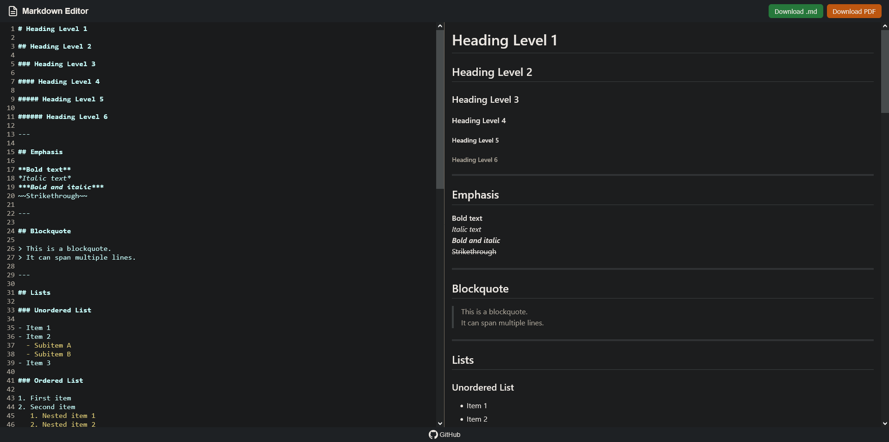

# Markdown Editor and Renderer with PDF Export

This project is a simple browser-based Markdown editor with live preview, syntax highlighting, and export options. It provides a split-screen interface where you can edit Markdown on the left and see the rendered output on the right.

## Features

* **Live Preview**: Markdown text is instantly rendered to HTML.
* **Syntax Highlighting**: Code blocks are highlighted using highlight.js.
* **PDF Export**: Content can be exported to PDF using the browser’s print dialog.
* **Markdown Export**: Save your work directly as a `.md` file.
* **CodeMirror Editor**: Rich editing experience with line numbers, dark theme, and word wrapping.
* **GitHub-Style Rendering**: Preview is styled with GitHub Markdown CSS for familiarity.

## Technologies Used

* [Marked.js](https://github.com/markedjs/marked) for Markdown parsing
* [highlight.js](https://highlightjs.org/) for syntax highlighting
* [CodeMirror](https://codemirror.net/) for the text editor
* [html2pdf.js](https://github.com/eKoopmans/html2pdf.js) for PDF generation
* GitHub Markdown CSS for preview styling

## How to Use

1. Clone or download this repository.
2. Open the `index.html` file in your browser.
3. Write or paste Markdown into the editor on the left.
4. See the rendered Markdown in the right-hand preview.
5. Export your work:

   * Click **Download .md** to save your Markdown text.
   * Click **Download PDF** to export the preview as PDF.

## Example Content

The editor comes preloaded with sample Markdown, including:

* Headings
* Emphasis styles
* Lists (ordered and unordered)
* Code blocks with syntax highlighting
* Tables, links, and images
* Blockquotes and horizontal rules
* Task lists

## License

This project is open-source. You are free to use and adapt it for personal or professional purposes.

